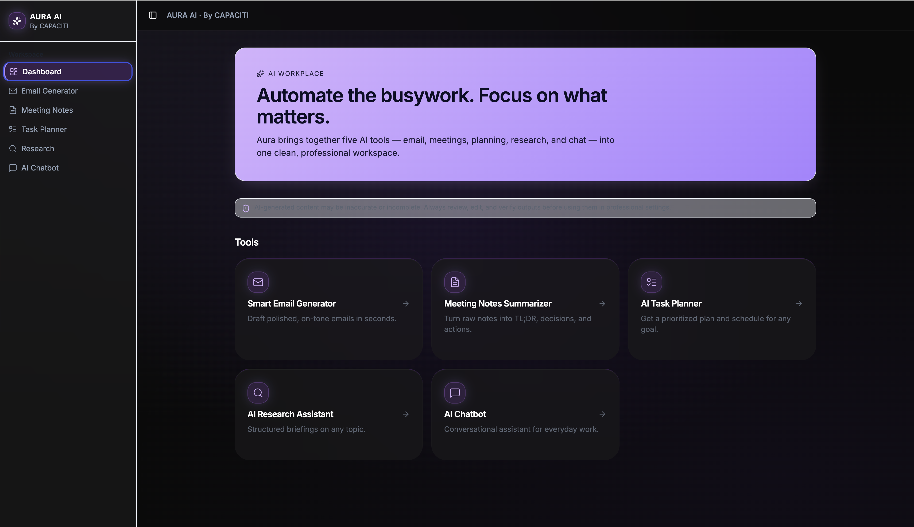
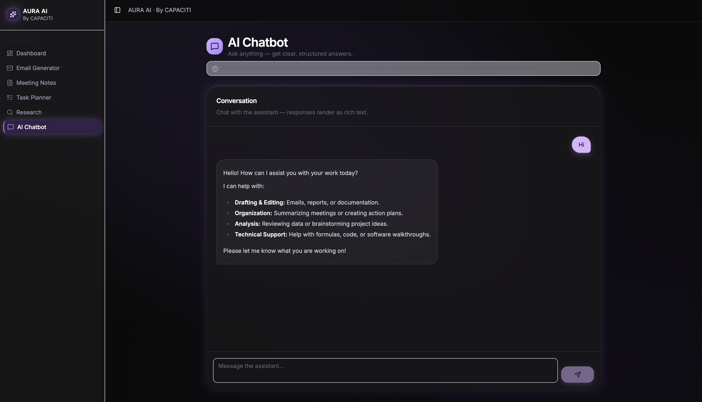
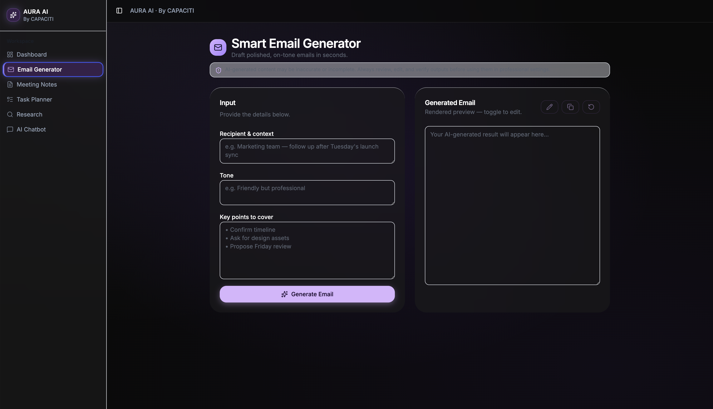
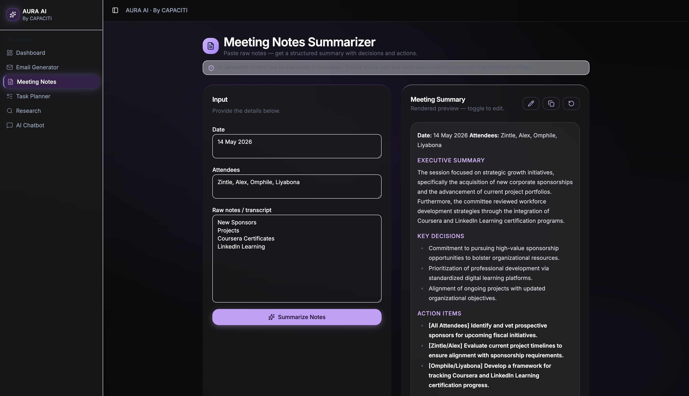
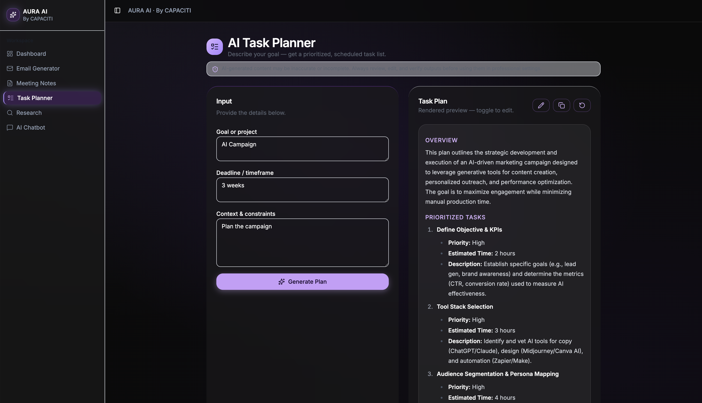
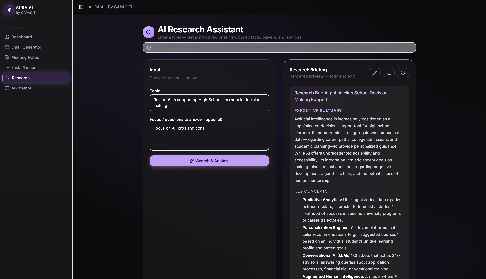

# AURA AI — By CAPACITI 

## Project Overview
**AURA AI** is a comprehensive, single-platform dashboard designed to automate and streamline essential workplace tasks. Developed during the **AI Skills Acceleration (ASA_2) program**, this project demonstrates the practical application of Generative AI, sophisticated prompt engineering, and premium UI/UX design to solve real-world productivity challenges.

**Author:** Zintle Mgqongose  
**Institution:** CAPACITI

---# AURA AI — By CAPACITI 

## Project Overview
**AURA AI** is a comprehensive, single-platform dashboard designed to automate and streamline essential workplace tasks. Developed during the **AI Skills Acceleration (ASA_2) program**, this project demonstrates the practical application of Generative AI, sophisticated prompt engineering, and premium UI/UX design to solve real-world productivity challenges.

**Author:** Zintle Mgqongose  
**Institution:** CAPACITI

---

## 🎨 Design Philosophy: Glassmorphism
The platform features a **Soft Glassmorphism** design aesthetic, focusing on a futuristic and professional "SaaS" feel:

*   **Frosted Glass Effects:** Translucent containers with background blurs that create depth.
*   **Luxury Dark Theme:** A "Dark Nude" and "Midnight Lilac" color palette designed to reduce eye strain.
*   **Glow Accents:** Subtle purple/lilac glows to highlight active tools and AI-generated outputs.

---

## 🛡️ Responsible AI & Human Review
AURA AI is built on the principle of **Human-in-the-loop (HITL)** to ensure ethical and accurate AI usage:

*   **Mandatory Human Review:** All AI-generated responses are displayed in editable text areas, requiring human verification before professional use.
*   **Transparency Disclaimer:** A persistent notice is visible across the platform, clearly stating that content is AI-assisted.

---

## ✨ Features & Tool Showcase
This platform integrates **five core AI-powered tools** into one responsive dashboard:

### 💬 AI Chatbot Interface
Interactive assistant for real-time queries and structured support.

### 📧 Smart Email Generator
Drafts professional correspondence across various tones (formal, friendly, persuasive).

### 📝 Meeting Notes Summarizer
Converts raw notes into Executive Summaries, including key decisions and action items.

### 📅 AI Task Planner
Breaks down complex projects into manageable milestones and schedules.

### 🔍 AI Research Assistant
Provides structured research briefings and summaries of complex topics.

---

## 🛠 Tools & Technologies
*   **AI Engine:** OpenAI GPT-4o (via Lovable AI)
*   **Frontend:** React / Tailwind CSS (Custom Glassmorphism styles)
*   **Version Control:** GitHub
*   **Compatibility:** Fully responsive for both Desktop and Mobile devices.

---

## ⚙️ Setup Instructions
*   **Prerequisites:** A modern web browser and Node.js installed locally.
*   **Clone Repository:** `git clone https://github.com/ZintleMgqongose/zintlemgqongose-AI-Productivity-Assistant.git`
*   **Install Dependencies:** `npm install`
*   **Run Development Server:** `npm run dev`

---

**© 2026 Zintle Mgqongose | CAPACITI AI Skills Acceleration**

## 🎨 Design Philosophy
The platform features a **Soft Glassmorphism** design aesthetic, characterized by:

* **Frosted Glass Effects:** Translucent containers with background blurs that create depth and a modern **"SaaS"** feel.
* **Luxury Dark Theme:** A "Dark Nude" and "Midnight Lilac" color palette to reduce eye strain and provide a premium user experience.
* **Glow Accents:** Subtle purple/lilac glows to highlight active tools and AI-generated outputs.

---

## 🛡️ Responsible AI & Human Review
AURA AI is built on the principle of **Human-in-the-loop (HITL)**:

* **Mandatory Human Review:** All AI-generated responses are displayed in editable text areas. This ensures that a human must review and approve the content before it is finalized.
* **Transparency Disclaimer:** A persistent notice is visible where needed, clearly stating that the content is AI-assisted and requires human verification for professional accuracy.

---

## ✨ Features
This platform integrates **five core AI-powered tools** into one responsive dashboard:

* **AI Chatbot Interface:** Interactive assistant for real-time queries and structured support.
* **Smart Email Generator:** Drafts professional correspondence across various tones (formal, friendly, persuasive).
* **Meeting Notes Summarizer:** Converts raw notes into Executive Summaries, including key decisions and action items.
* **AI Task Planner:** Breaks down complex projects into manageable milestones and schedules.
* **AI Research Assistant:** Provides structured research briefings and summaries of complex topics.

---

## 🛠 Tools & Technologies
* **AI Engine:** OpenAI GPT-4o (via Lovable AI)
* **Frontend:** React / Tailwind CSS (Custom Glassmorphism styles)
* **Version Control:** GitHub
* **Compatibility:** Fully responsive for both Desktop and Mobile devices.

---

## ⚙️ Setup Instructions
* **Prerequisites:** A modern web browser and Node.js installed locally.
* **Clone Repository:** `git clone https://github.com/ZintleMgqongose/zintlemgqongose-AI-Productivity-Assistant.git`
* **Install Dependencies:** `npm install`
* **Run Development Server:** `npm run dev`
